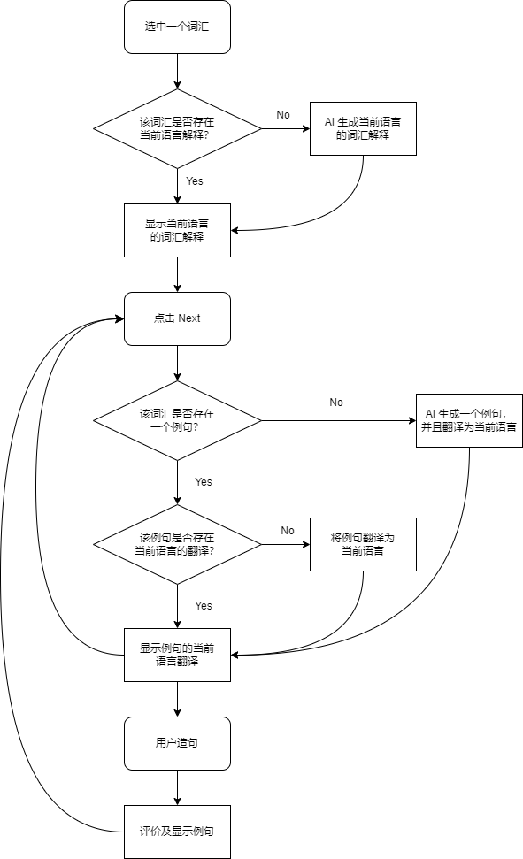

## 创建 Youtube 词汇教室(100)

### 创建房间

准备图片（同下面的99）

## 创建词汇教室(99)

### 创建房间

准备图片：

- Picture 480 x 270
- 压缩(https://tinypng.com/)
- 上传 R2

创建房间：

通过 API 创建词汇教室：

    POST airoom/room

### 创建词条（topics）

API:

    POST airoom/topic/words

## 词汇教室使用流程

