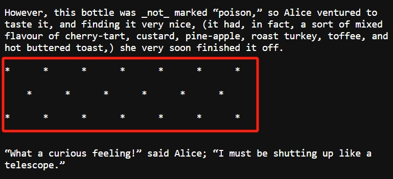

进入一个有声书房间

书籍来源主要来自古腾堡网站，下面以
以《爱丽丝漫游奇境》为例，如何上传并制作一本有声书。

## 

在网站上查找到图书[《爱丽丝漫游奇境》Alice's Adventures in Wonderland by Lewis Carroll](https://www.gutenberg.org/ebooks/11)，选取纯文本格式（Plain Text UTF-8）。

## 创建/更新一章文本内容

下面以《爱丽丝漫游奇境》第一章为例，说明如何上传本章文本。

本书上传地址：[《爱丽丝漫游奇境》编辑](https://airoom.chat/r/edit?rid=SLQGqC1Zr642&tid=i7EU4LD2YoCY)

1. 复制粘贴本章全部文本

2. 清理数据

删除不必要的下划线。这种下划线是强调文本，语音生成会产生多余的读音，因此要去掉：

不需朗读的内容也要删除：

3. SUBMIT。这样就创建了本章文本内容，以备下一步生成语音使用。

更新文本方法一样，也是上面的操作步骤。

## 生成语音

在 url 地址中去掉 edit，就是语音生成的地址。

本书阅读及语音生成地址：[《爱丽丝漫游奇境》](https://airoom.chat/r?rid=SLQGqC1Zr642&tid=i7EU4LD2YoCY)

选择一章，点击 > 按钮，就自动生成语音。

## 增加一章

在左边栏点击 + 按钮，输入章节标题，就可以创建新的章节：

## 《情迷四月天》

我已经完成了第1、2章，请从第3章开始做，谢谢！

[Gutenberg.org 原文地址](https://www.gutenberg.org/cache/epub/16389/pg16389.txt)

[文本编辑地址](https://airoom.chat/r/edit?rid=k2goS97c0xla&tid=i2m4y7zbgnBF)

[本书阅读及语音生成地址](https://airoom.chat/r?rid=k2goS97c0xla&tid=i2m4y7zbgnBF)

## 《了不起的盖茨比》- done

[Gutenberg.org 原文地址](https://www.gutenberg.org/cache/epub/64317/pg64317.txt)

[有声书](https://airoom.chat/r?rid=QCkv6VdoOxQO&tid=VEXUnIhKEJ9W)

## 《白鲸》

[Gutenberg.org 原文地址](https://www.gutenberg.org/cache/epub/2701/pg2701.txt)

[文本编辑](https://airoom.chat/r/edit?rid=0mYUbKPtv58Q&tid=ZTuOtKRejcPp)

[有声书](https://airoom.chat/r?rid=0mYUbKPtv58Q&tid=ZTuOtKRejcPp)

## 《弗兰肯斯坦》

[Gutenberg.org 原文](https://www.gutenberg.org/cache/epub/84/pg84.txt)

[文本编辑](https://airoom.chat/r/edit?rid=y0wkRIklQkri&tid=ZgQPc9LV1BZy)

[有声书](https://airoom.chat/r?rid=y0wkRIklQkri&tid=ZgQPc9LV1BZy)

